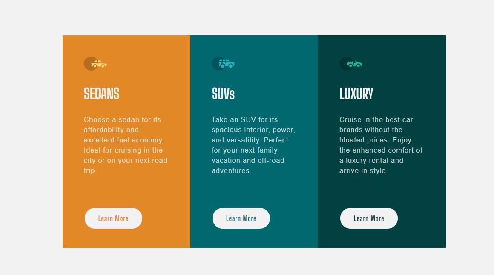

# Frontend Mentor - 3-column preview card component solution

This is a solution to the [3-column preview card component challenge on Frontend Mentor](https://www.frontendmentor.io/challenges/3column-preview-card-component-pH92eAR2-). Frontend Mentor challenges help you improve your coding skills by building realistic projects. 

## Table of contents

- [Overview](#overview)
  - [The challenge](#the-challenge)
  - [Screenshot](#screenshot)
  - [Links](#links)
- [My process](#my-process)
  - [Built with](#built-with)
  - [What I learned](#what-i-learned)
  - [Continued development](#continued-development)
  - [Useful resources](#useful-resources)
- [Author](#author)

## Overview

### The challenge

Users should be able to:

- View the optimal layout depending on their device's screen size
- See hover states for interactive elements

### Screenshot

### Links

- Live Site URL: https://ando96.github.io/3-column-preview-card-component/

## My process

### Built with

- Semantic HTML5 markup
- CSS custom properties
- Flexbox

### What I learned

Still improving my HTML and CSS skills

### Continued development

I want to focus on using flexbox more, I'm still not confident with it

### Useful resources

- [w3schools] https://www.w3schools.com/css/default.asp - Has everything you need when it comes to HTML and CSS basics
- [MDN] https://developer.mozilla.org/en-US/- Has a lot of useful and interesting information about the different HTML and CSS tags, I find a new attribute or tag everytime I'm looking for something

## Author

- Frontend Mentor - [@Ando96](https://www.frontendmentor.io/profile/Ando96)
